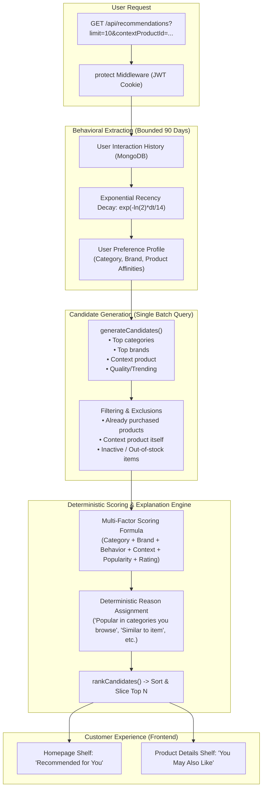

# Aethera Commerce

A production-quality AI-powered e-commerce platform featuring an immersive 3D shopping experience built with modern full-stack web technologies.

> **Status Notice:** This repository has completed **Part 1: Project Initialization**, **Part 2: Database Architecture**, **Part 3: Authentication & Authorization**, **Part 4: Product Catalog & Product APIs**, **Part 5: Customer Frontend**, **Part 6: Cart, Wishlist, Checkout & Order Management**, **Part 7: Reviews, Ratings & Verified Purchases**, **Parts 8–11: Three.js 3D Foundation, 3D Product Viewer, Customizer & Immersive Homepage**, and **Part 12: Interaction Tracking & Event Analytics**. Complete behavioral data layer, anonymous session tracking, strict server-side business event generation (`CART`, `WISHLIST`, `PURCHASE`, `RATING`), privacy data minimization, and automated test suites are 100% functional and verified.

---

## 1. Technology Stack

### Frontend
- **Runtime & Bundler:** Vite
- **UI Library:** React 19 / 18
- **Styling:** Tailwind CSS (Official Vite integration)
- **Routing:** React Router (`react-router-dom`)
- **State Management:** Redux Toolkit (`@reduxjs/toolkit`) & `react-redux`
- **HTTP Client:** Axios (configured with `withCredentials: true` for HTTP-only cookies)
- **Animations:** Framer Motion
- **3D Graphics:** Three.js, React Three Fiber (`@react-three/fiber`), Drei (`@react-three/drei`)

### Backend
- **Runtime:** Node.js (ES Modules)
- **Web Framework:** Express.js
- **Database:** MongoDB & Mongoose
- **Security & Identity:**
  - `bcryptjs` (One-way salted password hashing, 12 rounds)
  - `jsonwebtoken` (Signed JWT session tokens in HTTP-only cookies)
  - `cookie-parser` (HTTP-only cookie parser)
  - `express-validator` (Schema-based request payload validation)
  - `express-rate-limit` (General & auth-specific brute force rate limiting)
  - `helmet` (Secure HTTP response headers)
  - `cors` (Configured with credentials and trusted frontend origin)
  - `dotenv` (Environment variable management)
  - `nodemon` (Development hot-reloader)

---

## 2. System Architecture & Request Pipeline

```text
React Frontend (Redux Toolkit / Axios withCredentials: true)
                         │
                         ▼
                  Express Router
                         │
                         ▼
             express-validator (Schema validation)
                         │
                         ▼
        protect + authorize("admin") (JWT ownership guards)
                         │
                         ▼
         Controller (Extracts req, returns standardized JSON)
                         │
                         ▼
          Service Layer (Business rules, stock safety, snapshots)
                         │
                         ▼
        Mongoose Model (Schema validation, indexes, lean() reads)
                         │
                         ▼
                      MongoDB
```

---

## 3. Product Reviews, Ratings & Verified Purchases (Part 7)

### 3.1 Strict Verified Purchase Engine
Customers cannot submit a review simply by claiming ownership. When a customer sends `POST /api/products/:productId/reviews`:
```text
Client (POST /api/products/:productId/reviews { rating: 5, comment: "..." })
                         │
                         ▼
             Authenticate user (req.user._id)
                         │
                         ▼
        Find order owned by user with status: DELIVERED
        containing this product (items.product: productId)
                         │
          ┌──────────────┴──────────────┐
          ▼                             ▼
       Found                         Not Found
          │                             │
          ▼                             ▼
   Set verifiedPurchase = true   Reject 403 Forbidden
          │
          ▼
   Enforce One-Review-Per-User (user + product index)
          │
          ▼
   Save Review (isApproved: true, helpfulCount: 0)
          │
          ▼
   MongoDB Aggregation: Recalculate Product.rating & reviewCount
```

### 3.2 Server-Side Rating Calculation
Product scores and star breakdown distributions are never calculated by the frontend:
```javascript
// Aggregated across all approved reviews for a product:
const stats = await Review.aggregate([
  { $match: { product: new mongoose.Types.ObjectId(productId), isApproved: true } },
  { $group: { _id: "$rating", count: { $sum: 1 } } }
]);
averageRating = totalReviews > 0 ? Math.round((totalScore / totalReviews) * 10) / 10 : 0;
```
If all reviews are deleted, ratings safely reset to `0.0` with `0` reviews.

### 3.3 Helpful Review Voting
To prevent vote manipulation, helpful votes are tracked in a dedicated `ReviewHelpful` collection:
- Compound unique index: `{ user: 1, review: 1 }`
- Duplicate vote attempts by the same customer return `400 Bad Request`.
- Helpful counts increment atomically via `$inc: { helpfulCount: 1 }`.

### 3.4 Future AI Review Summarizer Foundation
Approved reviews stored in this subsystem provide clean, authentic customer sentiment data for subsequent AI review summarization and vector-based recommendations.

---

## 4. API Endpoints Table

### Authentication (`/api/auth`)
| Method | Endpoint | Access | Description |
| :--- | :--- | :--- | :--- |
| `POST` | `/api/auth/register` | Public | Register new customer account |
| `POST` | `/api/auth/login` | Public | Authenticate user, issue HTTP-only cookie |
| `POST` | `/api/auth/logout` | Public | Invalidate session, clear cookie |
| `GET` | `/api/auth/me` | Authenticated | Return profile of current user |

### Products & Categories (`/api/products`, `/api/categories`)
| Method | Endpoint | Access | Description |
| :--- | :--- | :--- | :--- |
| `GET` | `/api/products` | Public | Filtered, sorted, paginated product catalog |
| `GET` | `/api/products/:id` | Public | Product details by ID |
| `GET` | `/api/products/slug/:slug` | Public | Product details by slug |
| `GET` | `/api/categories` | Public | List categories with product count |

### Cart & Wishlist APIs (`/api/cart`, `/api/wishlist`)
| Method | Endpoint | Access | Description |
| :--- | :--- | :--- | :--- |
| `GET` | `/api/cart` | Authenticated | Get cart with live prices and subtotals |
| `POST` | `/api/cart/items` | Authenticated | Add item with variant choices |
| `PUT` | `/api/cart/items/:productId` | Authenticated | Update quantity with stock validation |
| `DELETE` | `/api/cart/items/:productId` | Authenticated | Remove item from cart |
| `DELETE` | `/api/cart` | Authenticated | Clear cart |
| `GET` | `/api/wishlist` | Authenticated | Get saved wishlist products |
| `POST` | `/api/wishlist/:productId` | Authenticated | Add product to wishlist |
| `DELETE` | `/api/wishlist/:productId` | Authenticated | Remove product from wishlist |
| `POST` | `/api/wishlist/:productId/move-to-cart` | Authenticated | Transfer wishlist product to cart |

### Address & Order APIs (`/api/addresses`, `/api/orders`, `/api/admin/orders`)
| Method | Endpoint | Access | Description |
| :--- | :--- | :--- | :--- |
| `GET` | `/api/addresses` | Authenticated | Get saved delivery addresses |
| `POST` | `/api/addresses` | Authenticated | Create address (auto-default first address) |
| `PUT` | `/api/addresses/:id` | Authenticated | Update address details |
| `DELETE` | `/api/addresses/:id` | Authenticated | Delete address |
| `POST` | `/api/coupons/validate` | Authenticated | Validate coupon against cart subtotal |
| `POST` | `/api/orders` | Authenticated | Place order (server calculation, atomic stock update) |
| `GET` | `/api/orders` | Authenticated | Paginated order history for current user |
| `GET` | `/api/orders/:id` | Authenticated | Order details (enforces ownership) |
| `PATCH` | `/api/orders/:id/cancel` | Authenticated | Cancel order and automatically restore stock |
| `GET` | `/api/admin/orders` | Admin | List all orders with filters and pagination |
| `PATCH` | `/api/admin/orders/:id/status` | Admin | Update status with lifecycle validation |

### Reviews & Ratings APIs (`/api/products/:id/reviews`, `/api/reviews`, `/api/admin/reviews`)
| Method | Endpoint | Access | Description |
| :--- | :--- | :--- | :--- |
| `GET` | `/api/products/:productId/reviews` | Public | Paginated approved reviews with sorting & rating filter |
| `GET` | `/api/products/:productId/reviews/summary` | Public | Aggregate average rating and 1-5 star distribution |
| `GET` | `/api/products/:productId/reviews/eligibility` | Authenticated | Check if user has delivered purchase and can review |
| `POST` | `/api/products/:productId/reviews` | Authenticated | Submit verified review for delivered purchase |
| `PUT` | `/api/reviews/:id` | Authenticated | Update own review (rating, comment) |
| `DELETE` | `/api/reviews/:id` | Authenticated | Delete review (author or admin) |
| `POST` | `/api/reviews/:id/helpful` | Authenticated | Mark review as helpful (1 vote per user) |
| `GET` | `/api/admin/reviews` | Admin | List all reviews across the platform |
| `PATCH` | `/api/admin/reviews/:id/moderate` | Admin | Moderate approval (`isApproved: true/false`) |
| `DELETE` | `/api/admin/reviews/:id` | Admin | Delete any review as admin |

---

## 5. Local Development Setup

### Prerequisites
- Node.js (v18+)
- npm (v9+)
- MongoDB running locally on port 27017 or a MongoDB Atlas URI

### Step-by-Step Installation

1. **Clone and Install:**
   ```bash
   cd Aethera-Commerce
   cd server && npm install
   cd ../client && npm install
   ```

2. **Configure Environment:**
   Create `server/.env`:
   ```env
   PORT=5000
   NODE_ENV=development
   MONGODB_URI=mongodb://127.0.0.1:27017/aethera_commerce
   JWT_SECRET=super_secret_jwt_key_aethera_2026_modern
   JWT_EXPIRES_IN=7d
   FRONTEND_URL=http://localhost:5173
   ```

3. **Seed Database:**
   ```bash
   cd server
   npm run seed        # Seeds categories, products, and coupons
   npm run seed:admin  # Seeds development administrator account
   ```

4. **Run Verification Test Suites:**
   ```bash
   npm run test:auth          # 17/17 passed (Authentication & RBAC)
   npm run test:product       # 28/28 passed (Product Catalog & CRUD)
   npm run test:checkout      # 42/42 passed (Cart, Wishlist, Addresses, Coupons, Checkout & Orders)
   npm run test:review        # 31/31 passed (Reviews, Ratings, Verified Purchases & Moderation)
   npm run test:customization # 7/7 passed (Part 10 3D Customization & Dynamic Materials)
   npm run test:interaction   # 35/35 passed (Part 12 Interaction Tracking & Event Analytics)
   npm run test:recommendation # 30/30 passed (Part 13 Personalized Recommendation Engine)
   ```

5. **Start Development Servers:**
   ```bash
   # Terminal 1: Backend
   cd server && npm run dev

   # Terminal 2: Frontend
   cd client && npm run dev
   ```

---

## 7. Development Roadmap

- [x] **Part 1:** Project Initialization, Architecture Setup, Express API with Health Check, React + Vite Foundation with Tailwind CSS, Redux, and Three.js dependencies.
- [x] **Part 2:** MongoDB Atlas & Mongoose Connection, Database Schemas (10 Models), Database Seeding (8 Categories, 32 Products, 6 Coupons).
- [x] **Part 3:** Authentication & Role-Based Authorization (JWT, bcryptjs, HTTP-only cookies, express-validator, admin seeding, automated test suite).
- [x] **Part 4:** Product Catalog API, Filtering, Pagination, Keyword Search, Category Navigation, Soft Deletion, Admin CRUD.
- [x] **Part 5:** Customer Frontend (Navbar, Home, Product Listing with URL Query Sync, Product Details, Gallery, Debounced Search, Redux Toolkit, Skeletons & Error Boundaries).
- [x] **Part 6:** Cart, Wishlist, Checkout & Order Management (Cart/Wishlist APIs, Address management, Coupon engine, Order snapshots, Atomic inventory deduction, Cancellation stock restoration, Redux slices, Checkout UI, Order tracking timeline).
- [x] **Part 7:** Reviews, Ratings & Verified Purchases (Verified purchase verification against DELIVERED orders, One-review uniqueness, MongoDB rating aggregation, Helpful voting, Admin moderation, RatingStars, ReviewSummary, ReviewForm, ReviewItem).
- [x] **Part 8:** Three.js + React Three Fiber Foundation (3D Scene Architecture, Perspective Camera, Studio 3-Point Lighting & Shadow Maps, RotatingCube PBR Demonstration, OrbitControls Constraints, Ground Pedestal, useFrame Animation Engine, Canvas Error Boundary, Aethera 3D Lab Showcase at `/3d-demo`).
- [x] **Part 9:** Real 3D Product Viewer with GLTF/GLB Models (Dynamic `model3D` loading via Drei `useGLTF`, `Box3` bounding-box centering & scale normalization, Studio Product Lighting, OrbitControls with reset & damping, Fullscreen API, in-canvas ModelLoader with download progress, zero-crash fallback error boundary, and lazy-loaded ProductDetails switcher).
- [x] **Part 10:** 3D Product Customization & Dynamic Material Engine (Live PBR color/finish switching, scene cloning to isolate mutations, original material snapshots for reset, color preset picker, metalness/roughness tuning).
- [x] **Part 11:** Immersive 3D Homepage (Progressive enhancement with 3 capability tiers, lazy-loaded Three.js R3F hero scene, single 74KB generic GLB model, pointer tracking without React state thrashing, WebGL & reduced-motion fallbacks, isolated API sections for Featured, Categories, and Trending products, Experience Section differentiator storytelling, conversion CTA, and zero-crash canvas error handling).
- [x] **Part 12:** Interaction Tracking & Event Analytics (Frontend client tracking service, debounced search & deduplicated views, UUID anonymous sessions, server-side business interaction generation for CART, WISHLIST, PURCHASE, and RATING, security protections against client userId spoofing, rate limiting, and analytics aggregation queries for Part 13 recommendation pipeline).
- [x] **Part 13:** Personalized Recommendation Engine (Behavioral signal extraction, exponential recency decay, user preference profiling, batch candidate generation without N+1 queries, multi-factor candidate scoring, deterministic reason badges, cold-start fallback, and frontend shelf integration on Homepage and Product Details).
- [ ] **Part 14:** Product Embeddings & Semantic Similarity.

---

## 4. Immersive 3D Homepage Architecture (Part 11)

### 4.1 Progressive Enhancement Strategy
Aethera's homepage is designed so 3D is a **visual enhancement rather than an absolute rendering dependency**. The page functions seamlessly across three capability tiers:
1. **Level 1 (Universal Browser):** Semantic HTML5, Tailwind CSS, React components, and responsive grid layouts. The page loads and operates 100% without WebGL or modern GPUs.
2. **Level 2 (Capable Hardware):** Renders the interactive 3D hero with an optimized GLB model (`/models/products/aether-sonar-headphones.glb`, 74 KB), studio lighting, subtle continuous turntable rotation, gentle vertical floating oscillation, and damped pointer tracking.
3. **Level 3 (Reduced Motion / Low-Capability):** Detects `(prefers-reduced-motion: reduce)` and hardware capability. If motion is restricted or WebGL is unavailable/crashes, gracefully displays a high-fidelity SVG/CSS static product card with specs, glowing gradient accents, and feature pills.

```text
               Client Device Check
                       │
         ┌─────────────┴─────────────┐
         ▼                           ▼
WebGL Available & Motion OK?     Reduced Motion or No WebGL?
         │                                   │
         ▼                                   ▼
Lazy-Load Hero3DScene (R3F)          Render HeroStaticVisual
         │                                   │
   ┌─────┴─────┐                             │
   ▼           ▼                             │
Success?     Error?                          │
   │           └──────────────┐              │
   ▼                          ▼              ▼
Active 3D Canvas        Static Hero Product Card Showcase
```

### 4.2 Code-Splitting & Lazy Loading
- The Three.js canvas layer is separated from React DOM UI and imported via `React.lazy(() => import("./Hero3DScene.jsx"))`.
- Wrapped in `<Suspense fallback={<Hero3DLoadingPlaceholder />}>` and `<CanvasErrorBoundary>`, ensuring that heavy Three.js assets do not delay initial DOM hydration or first contentful paint (FCP).

### 4.3 3D Performance Safeguards
- **Zero React State in `useFrame`:** High-frequency rotation and float math updates Three.js object `ref`s directly (`groupRef.current.rotation.y += delta * 0.25`).
- **No Per-Frame Allocations:** Scratch mathematical vectors (`THREE.Vector2`, `THREE.Vector3`) are instantiated once outside the render loop to eliminate garbage collection pauses.
- **DPR Capping:** Device Pixel Ratio is constrained to `dpr={[1, 1.5]}` to prevent GPU thermal throttling on 3x/4x mobile screens.
- **Single Model Constraint:** Only one generic, lightweight GLB is loaded for the hero (74 KB). Catalog products are rendered as standard 2D image cards on the homepage.

### 4.4 Homepage Data & Section Isolation
Every API-connected section is independently isolated:
- **`FeaturedProducts.jsx`:** Fetches curated staff picks (`GET /api/products/featured?limit=4`).
- **`CategoryShowcase.jsx`:** Dynamic categories from `GET /api/categories` with direct filtered links (`/products?category=...`).
- **`TrendingProducts.jsx`:** Top-sellers from `GET /api/products/trending?limit=4`.
- **`ExperienceSection.jsx`:** Storytelling showcase of 3D Digital Twins, Live Customization, and previewing the upcoming AI Concierge.
- **`CTASection.jsx`:** Conversion banner with newsletter signup and links to catalog (`/products`) and 3D Studio (`/3d-demo`).
- **Fault Tolerance:** If any single section API request fails, it renders an inline retry card without breaking other sections or crashing the homepage.

---

## 5. Interaction Tracking & Event Analytics Architecture (Part 12)

The behavioral data layer in Aethera Commerce connects user actions to an event-driven telemetry stream that will power the Part 13 recommendation engine, trending algorithms, and search analytics.

### 5.1 Architecture Overview

```mermaid
flowchart TD
    subgraph Client ["Client Layer (Frontend)"]
        UA[User Action]
        V_EVT["VIEW / SEARCH"]
        TS[trackingService.js]
    end

    subgraph API ["Ingestion & Security Layer"]
        EP["POST /api/interactions"]
        RL[Rate Limiter]
        AUTH[optionalProtect (JWT)]
        VAL[express-validator]
        IC[interactionController.js]
    end

    subgraph Internal ["Internal Business Operations"]
        CS[Cart Service]
        WS[Wishlist Service]
        OS[Order Service]
        RS[Review Service]
    end

    subgraph Service ["Core Analytics Engine"]
        IS[interactionService.js]
        SANITIZE[Data Minimization & Sanitizer]
    end

    subgraph DB ["Data Persistence"]
        MODEL[Interaction Model]
        MDB[(MongoDB)]
    end

    subgraph Next ["Future Services (Part 13)"]
        RECO[Recommendation Engine]
    end

    UA --> V_EVT
    V_EVT --> TS
    TS -->|Silent Axios Non-Blocking| EP
    EP --> RL --> AUTH --> VAL --> IC --> IS

    CS -->|Cart Updated| IS
    WS -->|Wishlist Toggled| IS
    OS -->|Order Created| IS
    RS -->|Review Approved| IS

    IS --> SANITIZE --> MODEL --> MDB
    MDB -->|Behavioral Aggregations| RECO
```

### 5.2 Event Taxonomy & Trust Boundaries

To ensure behavioral data integrity, events are strictly segregated between client-reported and server-verified:

| Interaction Type | Meaningful Action | Origin / Source | Verification / Trust Boundary |
| :--- | :--- | :--- | :--- |
| `VIEW` | User opens a product details page | Frontend (`trackingService.trackView`) | Public endpoint with optional auth; deduplicated by product ID per page visit. |
| `SEARCH` | User completes a search query | Frontend (`trackingService.trackSearch`) | Public endpoint with optional auth; trimmed, normalized query (max 150 chars). |
| `WISHLIST` | User toggles item in wishlist | Backend (`wishlistService`) | **Server-side only** upon successful DB wishlist toggle (`action: "add"/"remove"`). |
| `CART` | User adds/modifies/removes cart items | Backend (`cartService`) | **Server-side only** upon successful atomic cart update (`action: "add"/"update"/"remove"`). |
| `PURCHASE` | User successfully places an order | Backend (`orderService`) | **Server-side only** inside order creation transaction; client cannot spoof orders. |
| `RATING` | User submits verified product review | Backend (`reviewService`) | **Server-side only** after delivered purchase verification and review DB persistence. |

### 5.3 Anonymous vs. Authenticated Sessions

- **Anonymous Visitors:** If no authenticated user exists, the frontend assigns a random UUID v4 stored in `localStorage` (`aethera_session_id`).
- **Session Identity Trade-Offs:**
  - *Why `localStorage`?* Persists across browser tabs and short browsing sessions without requiring server roundtrips or third-party cookie permissions.
  - *Why not IP Address?* IP addresses violate GDPR privacy principles, change dynamically (NAT, mobile carriers, VPNs), and conflate multiple users sharing a local network (e.g. coffee shop or office).
- **Authenticated Users:** Identified exclusively from verified JWT cookies via `optionalProtect` middleware (`req.user._id`). The client is **forbidden** from providing a `userId` in payloads.

### 5.4 Data Minimization & Privacy Protection

The interaction layer adheres to strict privacy safeguards:
1. **Payload Stripping:** `interactionService.js` automatically strips sensitive fields (`password`, `token`, `cardNumber`, `cvv`, `address`, `email`, `secret`) from metadata objects.
2. **Metadata Size Limit:** Ingestion payloads enforce a maximum size of 2 KB.
3. **Non-Blocking UX:** Client-side tracking is completely fire-and-forget (`.catch(() => {})`). A network timeout or analytics failure will never interrupt or degrade checkout, browsing, or 3D viewer interactions.

### 5.5 MongoDB Compound Indexes

```javascript
InteractionSchema.index({ user: 1, createdAt: -1 });      // Chronological user timeline for personalization
InteractionSchema.index({ product: 1, type: 1 });          // Product engagement metrics
InteractionSchema.index({ type: 1, createdAt: -1 });       // Platform trending & recent velocity
InteractionSchema.index({ sessionId: 1, createdAt: -1 }); // Anonymous session sequence recovery
```

### 5.6 Analytic Queries Preparing for Part 13

The `interactionService.js` provides high-performance MongoDB aggregation helpers:
- `getMostViewedProducts({ limit, timeframeDays })`: Ranks products by recent unique view velocity.
- `getMostSearchedTerms({ limit, timeframeDays })`: Identifies trending consumer keywords and catalog demand gaps.
- `getMostAddedToCartProducts({ limit, timeframeDays })`: Highlights high-intent conversion candidates.
- `getProductEngagement(productId)`: Computes aggregate breakdown across all 6 interaction types for a product.
- `getUserInteractions(userId, { limit, types })`: Retrieves the chronological behavioral vector to build user affinity profiles for collaborative filtering.

---

## 6. Personalized Recommendation Engine Architecture (Part 13)

The recommendation engine in Aethera Commerce is a deterministic, explainable, first-generation recommender built on behavioral signals, product metadata, and exponential recency decay. It serves as the baseline before introducing vector embeddings in Part 14.

### 6.1 Recommendation Pipeline



### 6.2 Mathematical Scoring Formulation

#### 1. Interaction Intent Weights
Heuristic base weights reflect relative consumer purchase intent:
```javascript
VIEW: 1      // Weak discovery signal
SEARCH: 2    // Explicit intent signal
RATING: 3    // Qualitative satisfaction signal
WISHLIST: 4  // Strong consideration signal
CART: 5      // High purchase consideration
PURCHASE: 6  // Strongest verified transaction signal
```

#### 2. Exponential Recency Decay
Older signals are discounted so that recent activities carry more weight:
$$\text{recencyFactor} = \exp\left(-\frac{\ln(2) \cdot \Delta t}{\text{halfLifeDays}}\right)$$
* $\text{halfLifeDays} = 14$ days.
* $\Delta t = 0$ days $\to \text{factor} = 1.0$
* $\Delta t = 14$ days $\to \text{factor} = 0.5$
* $\Delta t > 90$ days $\to \text{factor} = 0.0$ (excluded from computation window)

#### 3. Candidate Scoring Formula
$$\text{Score} = w_{\text{cat}} \cdot S_{\text{cat}} + w_{\text{brand}} \cdot S_{\text{brand}} + w_{\text{behavior}} \cdot S_{\text{behavior}} + w_{\text{context}} \cdot S_{\text{context}} + w_{\text{pop}} \cdot S_{\text{pop}} + w_{\text{rating}} \cdot S_{\text{rating}}$$
* Category weight ($w_{\text{cat}} = 3.5$): Normalized affinity to user's top categories.
* Brand weight ($w_{\text{brand}} = 2.5$): Normalized affinity to user's top brands.
* Past Behavior weight ($w_{\text{behavior}} = 2.0$): Repeat interest in specifically browsed/carted items.
* Context Similarity weight ($w_{\text{context}} = 2.5$): Same-category (+0.75) and same-brand (+0.45) complementary matches when viewing a product.
* Catalog Popularity weight ($w_{\text{pop}} = 1.5$): Scaled sales count.
* Rating Quality weight ($w_{\text{rating}} = 1.5$): Normalized customer review rating ($/ 5.0$).

### 6.3 Explainable Reason Assignment
Rather than unconstrained LLM text, reasons are deterministic and trace directly to the dominant score component:
* Dominant Category $\to$ `"Popular in categories you browse"`
* Dominant Brand $\to$ `"From a brand you frequently explore"`
* Dominant Context $\to$ `"Similar to the item you're viewing"`
* Dominant Behavior $\to$ `"Based on your recent activity"`
* High Rating $\to$ `"Highly rated by Aethera shoppers"`
* Fallback / Cold-Start $\to$ `"Trending across Aethera"` or `"Featured by Aethera curators"`

### 6.4 Cold-Start & Exclusion Guarantees
* **Cold-Start Fallback**: If a newly registered user has zero interactions, `getColdStartRecommendations()` produces high-confidence recommendations using platform featured picks, top-rated products, and sales leaders.
* **Exclusion of Purchased Items**: Products previously purchased (`PURCHASE` interaction) are strictly omitted from standard recommendation shelves.
* **Performance Guarantee**: All candidate products are retrieved in a single batch MongoDB query (`$in`, `$or`, `.lean()`), preventing N+1 database roundtrips.


