# Part 14 — Product Embeddings & Semantic Similarity

## Overview

Part 14 establishes the **semantic intelligence layer** for Aethera Commerce. Until Part 13, the platform evaluated catalog data and user behavior based on structured attributes (Category, Brand, Price, Rating, History). Part 14 equips the platform to understand **meaning** by transforming product catalog descriptions, specifications, and tags into high-dimensional vector embeddings stored directly inside MongoDB Atlas, queried via Atlas Vector Search.

---

## Architecture Flow

```mermaid
flowchart TD
    subgraph Ingestion["Catalog Ingestion & Change Detection"]
        A[Product Document] --> B[buildProductEmbeddingText]
        B --> C[Compute SHA-256 Hash]
        C --> D{Hash == storedHash?}
        D -- "Yes (Unchanged)" --> E[Skip Embedding API - 0 Cost]
        D -- "No (Content Changed)" --> F[Call Embedding Provider: OpenAI / Gemini / Mock]
        F --> G[1536-Dimensional Numeric Vector]
        G --> H[(MongoDB: embedding + hash)]
    end

    subgraph Retrieval["Semantic Similarity Retrieval"]
        I[Client: View Product Details] --> J[GET /api/products/:id/similar?limit=8]
        J --> K[Load Target Product Vector]
        K --> L{Atlas $vectorSearch Supported?}
        L -- "Yes (Atlas Cluster)" --> M["Atlas $vectorSearch + $match (isActive, stock > 0, _id != target)"]
        L -- "No / Local Fallback" --> N[Structured Recommendation Fallback: Category & Brand Affinity]
        M --> O[Ranked Similar Products with similarityScore]
        N --> O
        O --> P[Sanitized JSON Response - Raw Vectors Excluded]
        P --> Q[SimilarProducts.jsx Component]
    end
```



---

## 1. What is an Embedding?

An embedding converts unstructured human language into a fixed-length numerical vector situated in a continuous high-dimensional geometric space.

```text
"lightweight running shoes with supercritical cushioning"
                         ↓
               Embedding Model
                         ↓
[-0.0142, 0.0481, 0.0093, -0.0712, ..., 0.0319] (1536 dimensions)
```

In this vector space, geometric proximity corresponds to conceptual closeness. Even if two products share zero identical words, their vectors point in similar directions if their semantic meaning is related.

---

## 2. Keyword Search vs. Semantic Search

| Dimension | Keyword / Lexical Search | Semantic Vector Search |
| :--- | :--- | :--- |
| **Core Mechanism** | Inverted index string matching (BM25 / TF-IDF) | Dot product / Cosine distance in vector space |
| **Query: "shoes for long-distance jogging"** | Fails to match products titled "cushioned marathon footwear" | Recognizes conceptual synonymy and returns marathon shoes |
| **Spelling & Phrasing Variations** | Brittle; requires extensive synonym lists and stemming | Inherently resilient to paraphrasing and descriptive queries |
| **Contextual Nuance** | Treats words in isolation | Captures context across names, tags, and specifications |

---

## 3. Product Embedding Text Pipeline

Raw product names (e.g., `"Aether Runner Pro"`) lack sufficient semantic context for embedding models. Aethera constructs a deterministic canonical representation combining key descriptive attributes while strictly filtering out non-semantic and operational data:

```text
Product: Aether Runner Pro
Category: Shoes
Brand: Aether
Description: Lightweight running shoe engineered with supercritical foam cushioning for marathon training and long-distance road runs.
Tags: athletic, cushioned, endurance, lightweight, marathon, running
Specifications: Drop: 8mm, Midsole: Supercritical TPU Foam, Outsole: High-traction Carbon Rubber, Weight: 215g
Attributes: Colors: Midnight Black, Volt Green; Sizes: US 8, US 9, US 10, US 11
```

### Strict Exclusions:
- **Never included**: Passwords, user IDs, payment information, internal database keys (`_id`, `__v`).
- **Omitted to prevent unnecessary re-embedding**: Volatile operational metrics (`price`, `discount`, `stock`, `rating`, `reviewCount`, `salesCount`, `timestamps`).

---

## 4. Cost Control & Change Detection (SHA-256 Hashing)

Calling commercial embedding APIs (e.g., OpenAI `text-embedding-3-small` or Gemini `text-embedding-004`) on every product read or update is cost-prohibitive.

### Mechanism:
1. When a product is updated or batch-indexed, `buildProductEmbeddingText(product)` generates canonical text.
2. `computeEmbeddingHash(text)` calculates a SHA-256 hash.
3. If `product.embeddingSourceHash === hash` and an existing vector is present:
   - **The embedding call is completely skipped** (`updated: false, reason: "unchanged"`).
4. If any semantic field changed (e.g., description, tags, specifications):
   - The hash differs, triggering re-embedding and atomic persistence of the vector and new hash.

---

## 5. Why MongoDB Atlas Vector Search?

Aethera Commerce stores core transactional and catalog data in MongoDB. Utilizing **MongoDB Atlas Vector Search** provides substantial engineering advantages:
1. **Single Data Store**: Eliminates the overhead, synchronization latency, and operational cost of maintaining a separate dedicated vector database (e.g., Pinecone, Milvus, Qdrant).
2. **ACID Consistency**: Product updates and embedding vectors persist in the same document transactionally.
3. **Unified Aggregation Pipeline**: Atlas `$vectorSearch` seamlessly combines with standard aggregation stages (`$match`, `$lookup`, `$project`, `$limit`).

### Atlas Vector Search Index Configuration

To enable vector search on MongoDB Atlas, create a Search Index on the `products` collection with the following JSON definition:

```json
{
  "fields": [
    {
      "type": "vector",
      "path": "embedding",
      "numDimensions": 1536,
      "similarity": "cosine"
    },
    {
      "type": "filter",
      "path": "isActive"
    },
    {
      "type": "filter",
      "path": "stock"
    }
  ]
}
```

> **Important**: `numDimensions` must match your configured embedding model (`1536` for OpenAI `text-embedding-3-small`, `768` for Google Gemini `text-embedding-004`).

---

## 6. Trade-off: `numCandidates` vs `limit`

In MongoDB Atlas `$vectorSearch`:
```javascript
{
  $vectorSearch: {
    index: "product_embedding_index",
    path: "embedding",
    queryVector: targetVector,
    numCandidates: Math.max(50, Math.min(200, limit * 15)),
    limit: limit + 5
  }
}
```

- **`limit`**: The maximum number of nearest neighbor documents to return from the stage.
- **`numCandidates`**: The size of the dynamic candidate list evaluated during the Hierarchical Navigable Small World (HNSW) graph traversal.
  - **Higher `numCandidates`**: Increases search recall and ensures truly closest semantic matches aren't pruned early, but consumes more search memory and CPU.
  - **Lower `numCandidates`**: Provides ultra-fast sub-millisecond retrieval with a small risk of missing borderline neighbors.
  - **Aethera Strategy**: Sets `numCandidates = clamp(50, 200, limit * 15)`, yielding 60-120 candidates for typical shelf displays (`limit = 4 to 8`).

---

## 7. Resilient Fallback Strategy

When running in local development (standalone MongoDB Community without Atlas) or before the Atlas Vector index has finished building:
1. The service detects `$vectorSearch` unavailability without crashing.
2. It automatically invokes `getStructuredFallback(targetProduct, limit)`.
3. Candidate products are selected based on category affinity, brand affinity, and sales/ratings.
4. Products are returned in the exact same format, with `similarityScore` mapped as a heuristic ranking signal.

---

## 8. Security & Data Integrity

1. **API Key Secrecy**: Embedding API keys (`EMBEDDING_API_KEY`) remain strictly on the backend and are never sent to the browser or bundled in Vite.
2. **Zero Client Tampering**: Product creation and update controllers actively delete any incoming `embedding` or `embeddingSourceHash` payload keys.
3. **Hidden Vector Projection**: Both `embedding` and `embeddingSourceHash` have `select: false` on the Mongoose schema. Standard catalog queries, product listings, and single product reads never transmit large vector arrays over the wire.
4. **RBAC Protection**: Bulk embedding generation (`POST /api/admin/products/generate-embeddings`) requires authenticated administrator credentials (`protect`, `authorize("admin")`).

---

## 9. Integration with Part 13 Recommendations & Part 15 Semantic Search

Part 14 does **not** replace the Part 13 recommendation engine. They represent distinct, complementary intelligence signals:

- **Part 13 (Behavioral Signals)**: Personalization based on user interaction history (views, carts, purchases, recency decay).
- **Part 14 (Semantic Similarity)**: Meaning-based item-to-item relatedness independent of user identity.

In subsequent phases, these signals fuse into a **Hybrid Recommendation Architecture**:

```text
                 ┌─────────────────────────┐
                 │ User Behavioral History │
                 │  (Part 13 Rec Engine)   │
                 └────────────┬────────────┘
                              │
                      Candidate Pool
                              │
                 ┌────────────┴────────────┐
                 │   Semantic Similarity   │
                 │   (Part 14 Vector Svc)  │
                 └────────────┬────────────┘
                              │
                    Hybrid Scored Ranking
                              ↓
                  Optimized Recommendations
```

Furthermore, Part 14 vector infrastructure provides the foundation for **Part 15 — Semantic Product Search**, where free-form customer search queries will be embedded and matched against these product vectors.

---

## 10. CLI Maintenance Commands

```bash
# Generate / update embeddings for all catalog products (skips unchanged products)
npm run embeddings:generate

# Force regenerate all embeddings regardless of cache
npm run embeddings:generate -- --force

# Custom batch size
npm run embeddings:generate -- --batch-size=50

# Run automated test suite (44 test assertions)
npm run test:embedding
```
