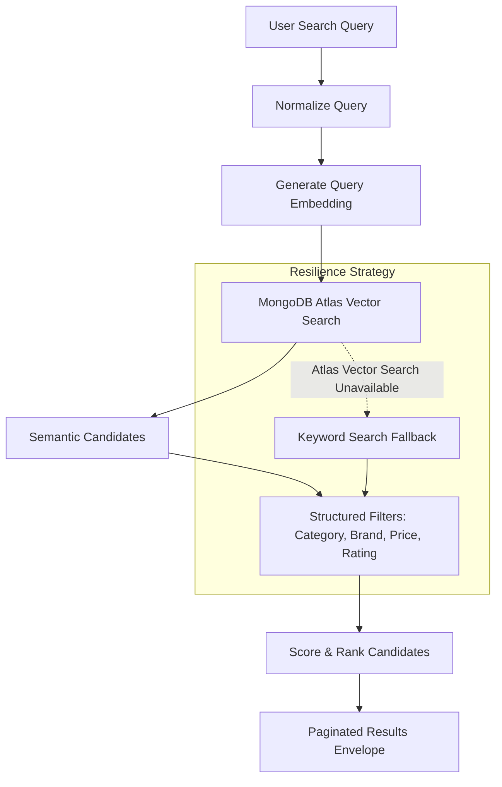

# Part 15 — Semantic Product Search

## Overview

Part 15 implements **AI-powered semantic search** for Aethera Commerce. Building directly on the product embedding and vector infrastructure established in Part 14, this system enables customers to search by **conceptual meaning, design intent, and natural language descriptions** rather than relying exclusively on exact lexical string matching.

---

## 1. Search Architecture



---

## 2. Keyword Search vs. Semantic Search

| Feature | Lexical / Keyword Search | Semantic Vector Search |
| :--- | :--- | :--- |
| **Matching Technique** | Text index / Tokenized string overlap | High-dimensional geometric cosine similarity |
| **Query: *"comfortable shoes for marathon training"*** | Fails if catalog product says *"breathable footwear for long distance runs"* | Recognizes synonymous concepts and retrieves the running shoes |
| **Exact Term / SKU Queries** | Superior for exact product names (`"Aether Corebook Pro 16"`) | Good, but can occasionally prioritize conceptual matches over exact strings |
| **Natural Language Queries** | Poor; brittle to filler words, prepositions, and descriptive phrasing | Excellent; captures intent across descriptive sentences |
| **Aethera Strategy** | Preserved via `searchMode: "keyword"` | Enhanced default via `searchMode: "semantic"` |

---

## 3. Query Normalization & Embedding Pipeline

### 3.1 Normalization
- Collapses consecutive whitespace characters to single spaces.
- Strips non-printable ASCII control characters.
- **Strictly preserves natural language grammar**: Prepositions (e.g., *"shoes for trail running"*, *"laptop with high battery life"*) are intentionally preserved because embedding models use surrounding context to determine intent.
- No generative LLM is used in the query pipeline, eliminating hallucination risks.

### 3.2 Query Embedding
- Uses `generateEmbedding(normalizedQuery)` from [`embeddingService.js`](file:///c:/Users/kumar/Downloads/Aethera/server/src/services/embeddingService.js).
- **Critical Requirement**: Uses the exact same model (`text-embedding-3-small` / `text-embedding-004`) and dimensionality (`1536` / `768`) as stored product embeddings. Comparing vectors from different models produces mathematically meaningless distances.
- **Security**: The raw query vector array is never returned to the frontend or exposed over HTTP.

---

## 4. MongoDB Atlas Vector Search Pipeline

```javascript
[
  {
    $vectorSearch: {
      index: "product_embedding_index",
      path: "embedding",
      queryVector: queryVector,
      numCandidates: Math.max(50, Math.min(300, page * limit + 80)),
      limit: Math.min(200, page * limit + 40)
    }
  },
  {
    $match: structuredFilters
  },
  {
    $lookup: {
      from: "categories",
      localField: "category",
      foreignField: "_id",
      as: "category"
    }
  },
  {
    $unwind: {
      path: "$category",
      preserveNullAndEmptyArrays: true
    }
  },
  {
    $project: {
      _id: 1,
      name: 1,
      slug: 1,
      description: 1,
      brand: 1,
      price: 1,
      discount: 1,
      finalPrice: 1,
      images: 1,
      category: { _id: "$category._id", name: "$category.name", slug: "$category.slug" },
      rating: 1,
      reviewCount: 1,
      stock: 1,
      isFeatured: 1,
      salesCount: 1,
      similarityScore: { $round: [{ $meta: "vectorSearchScore" }, 4] }
    }
  }
]
```

### Trade-off: `numCandidates` vs. Query Latency
- **`limit`**: Maximum number of documents emitted by the `$vectorSearch` stage.
- **`numCandidates`**: Size of the dynamic candidate list evaluated by the Hierarchical Navigable Small World (HNSW) graph index.
  - **Higher `numCandidates`**: Increases search recall and ensures relevant candidates are not pruned before structured post-filtering, at the cost of slightly higher memory traversal and latency.
  - **Lower `numCandidates`**: Offers sub-millisecond retrieval speeds with a risk of lower recall if aggressive post-filters (e.g. high price thresholds) eliminate early candidates.
  - **Dynamic Strategy**: Calculated dynamically based on the requested page and limit: `clamp(50, 300, page * limit + 80)`.

---

## 5. Structured Metadata Filtering

Explicit user constraints must never be left to probabilistic embedding similarity:
- **Category**: Filtered by resolved MongoDB ObjectId or category slug.
- **Brand**: Filtered by case-insensitive exact string regex.
- **Price Range**: Filtered by `finalPrice: { $gte: minPrice, $lte: maxPrice }`.
- **Minimum Rating**: Filtered by `rating: { $gte: rating }`.
- **Availability**: Products with `isActive: false` or `stock: 0` are strictly excluded.
- **Security**: Query parameters are explicitly sanitized. Direct client input is never merged into MongoDB query objects, preventing operator injection (`$gt`, `$ne`).

---

## 6. Resilient Fallback Strategy

If MongoDB Atlas `$vectorSearch` is not supported (e.g., local standalone MongoDB Community Edition without Atlas CLI deployment) or if the external embedding provider encounters downtime:
1. The exception is safely caught by [`semanticSearchService.js`](file:///c:/Users/kumar/Downloads/Aethera/server/src/services/semanticSearchService.js).
2. The search fails over cleanly to lexical keyword search via `productService.getProducts()`.
3. The response is returned with `searchMode: "keyword_fallback"`.
4. The frontend displays the results seamlessly with an informative note without breaking the user experience.

---

## 7. Interaction Analytics Tracking

When an authenticated customer searches:
- A `SEARCH` interaction event is recorded in MongoDB via [`interactionService.js`](file:///c:/Users/kumar/Downloads/Aethera/server/src/services/interactionService.js).
- Metadata captured: `{ query, source: "semantic_search", searchMode, totalResults, page }`.
- **Non-blocking Execution**: Interaction tracking runs asynchronously in the background. If analytics recording fails, the search response is delivered to the customer without delay.

---

## 8. Frontend Search Experience

- **Search Page**: [`client/src/pages/Search.jsx`](file:///c:/Users/kumar/Downloads/Aethera/client/src/pages/Search.jsx).
- **Mode Toggle**: Easily switch between **AI Semantic Search** and **Exact Keyword**.
- **Suggestion Chips**: Quick 1-click test prompts (*"comfortable shoes for marathon training"*, *"minimalist desk setup"*, *"wireless headphones for travel"*).
- **Collapsible Filter Bar**: Category, Brand, Min/Max Price, and Min Rating.
- **URL Synchronization**: Search state persists across browser refresh and back/forward navigation (`/search?q=...&mode=semantic&category=...&page=1`).

---

## 9. Future Hybrid Search Preparation

Semantic search and keyword search excel in different situations:
- **Keyword**: Best for exact SKUs, specific model numbers, and known brand names.
- **Semantic**: Best for descriptive queries, intent matching, and conceptual exploration.

In future iterations, Aethera will fuse these into a **Hybrid Search Engine** using Reciprocal Rank Fusion (RRF) or linear scoring:

$$\text{HybridScore} = \alpha \cdot \text{LexicalScore} + \beta \cdot \text{SemanticScore} + \gamma \cdot \text{BusinessSignals}$$

---

## 10. Key Interview Questions & Answers

### Q1: "How does your semantic search work?"
> *"I normalize the user's natural language query and convert it into a vector embedding using the same model that embeds the product catalog. I then query MongoDB Atlas Vector Search using the `$vectorSearch` aggregation stage to retrieve the top geometric nearest neighbors. After candidate retrieval, I apply structured post-filters for category, brand, price, and stock availability. The LLM is never used to hallucinate or invent catalog facts."*

### Q2: "Why keep keyword search if you have semantic search?"
> *"Semantic search is exceptional for descriptive and intent-based queries, but lexical keyword search remains superior for exact model names, SKUs, and specific alphanumeric terms like 'iPhone 17 Pro Max 256GB'. Preserving both allows us to serve both query types and prepares the architecture for hybrid search."*

### Q3: "How does your system handle vector search downtime or local development?"
> *"We implement a graceful fallback strategy. If the Atlas `$vectorSearch` stage is unsupported or the embedding service encounters downtime, the service catches the exception and falls back to structured keyword search, returning `searchMode: 'keyword_fallback'` so customers never encounter a 500 error or broken search page."*
