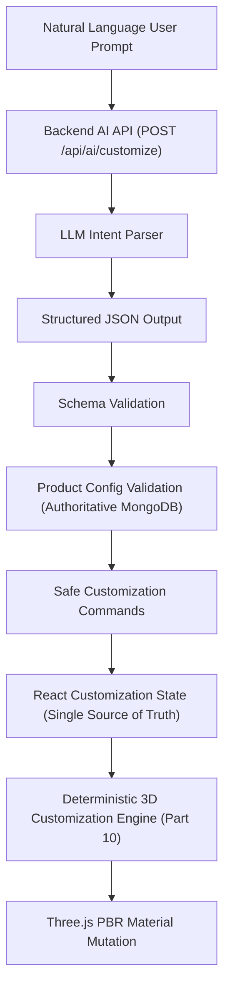

# Part 19 — AI + 3D Product Customization

Connecting natural language to deterministic 3D execution in Aethera Commerce.

---

## 1. Executive Summary & Core Security Invariant

Aethera Commerce connects natural-language user instructions to real-time 3D product customization. Customers can state what styling or finishes they desire (e.g., *"Make the headband midnight black and accent rings solar gold"*), and Aethera parses the intent, validates it against authoritative catalog specifications, and immediately mutates the Three.js model in real time.

### The Inviolable Security Boundary

```
          ❌ DANGEROUS & FORBIDDEN PATTERN:
          User Prompt ──> LLM ──> JavaScript ──> eval() ──> Three.js Scene

          ✅ AETHERA SECURE ARCHITECTURE:
          User Prompt ──> LLM ──> Structured JSON ──> Schema Validation 
                     ──> Product Config Validation ──> Safe Commands 
                     ──> Shared React State ──> Deterministic 3D Engine ──> Three.js
```

**Under no circumstances is model-generated JavaScript or code executed.**
- No `eval()`, `Function()`, or `<script>` tags.
- The LLM never touches Three.js scene graphs, materials, or meshes directly.
- The LLM acts solely as a **constrained intent parser** returning structured JSON.
- The backend application validates all changes against the authoritative product configuration stored in MongoDB.
- The existing deterministic customization engine (built in Part 10) executes only validated, safe commands.

---

## 2. Complete End-to-End Architecture



### Architectural Separation of Concerns
1. **AI Interprets**: Translates human speech into semantic intents (`customize_product`, `reset_customization`, `clarification_needed`).
2. **Backend Validates**: Enforces product rules, checks area and option bounds, normalizes colors, and rejects arbitrary mesh/code injections.
3. **Frontend Engine Executes**: Modifies cloned PBR materials on the in-memory scene graph with zero asset reloads.

---

## 3. Supported Intents & JSON Schema

### 1. `customize_product`
Applies valid modifications to authorized areas using configured product options.
```json
{
  "intent": "customize_product",
  "message": "Setting body to midnight black and trim to solar gold.",
  "changes": [
    {
      "area": "body",
      "property": "color",
      "value": "#0f172a"
    },
    {
      "area": "trim",
      "property": "color",
      "value": "#f59e0b"
    }
  ]
}
```

### 2. `reset_customization`
Restores the product back to its factory default materials without reloading the GLB asset.
```json
{
  "intent": "reset_customization",
  "message": "Resetting 3D customization back to original default specifications.",
  "changes": []
}
```

### 3. `clarification_needed`
Politely prompts the customer when a request is ambiguous or references unsupported capabilities (e.g. adding wings or non-existent areas).
```json
{
  "intent": "clarification_needed",
  "message": "Your request is too broad to determine which section to style.",
  "question": "Which area would you like to update: Headband & Shell, Ear Cushions, or Accent Trim Rings?",
  "changes": []
}
```

---

## 4. Product Configuration Validation & Color Normalization

### Authoritative Database Source of Truth
The client does not dictate what is customizable. The backend retrieves the product from MongoDB (`Product.findById(productId)`):
- Verifies product existence and visibility (`isActive: true`).
- Verifies `customization.enabled === true`.
- Inspects `customization.areas`.

### Validation Checklist
For every change returned by the LLM:
1. **Area Exists**: Does `change.area` match a configured area `id` or name in `product.customization.areas`?
2. **Property Supported**: Does `change.property` match the area's `type` (e.g. `color` or `material`)?
3. **Value Allowed**: Does `change.value` map to an authorized option in that specific area?
4. **No Code Execution**: Does the change contain any script tags, JavaScript URI schemes, or function invocations?
5. **Atomic Rejection**: If **any** change is invalid or unmapped, the entire command is rejected and converted into a `clarification_needed` response to prevent corrupt or partial state application.

### Color Normalization
Customers use everyday terms (*"black"*, *"dark"*, *"cyan"*, *"gold"*), whereas product configurations store exact IDs and hex codes (`#0f172a`, `midnight_black`). The normalization layer in `customizationValidationService` matches natural-language terms against configured option IDs, hex colors, and labels while strictly preventing arbitrary, unapproved hex values from being injected.

---

## 5. Defense in Depth: Cart, Checkout & Order Snapshots

Customization integrity does not stop at the AI endpoint. A malicious actor might bypass the AI endpoint and call `POST /api/cart/items` directly with forged customization data.

```
       Client Request
            │
            ▼
    AI API Validation
            │
            ▼
    React State Update
            │
            ▼
   POST /api/cart/items ──> Cart API Revalidation ──> MongoDB Cart
                                                           │
                                                           ▼
   POST /api/orders    ──> Checkout Revalidation ──> Final Order Snapshot
```

1. **Cart Boundary Revalidation**: `cartService.addItem` inspects `customization.custom3D`, revalidating every area and option against `product.customization.areas`. Forged or non-existent options throw HTTP 400.
2. **Checkout Boundary Revalidation**: `orderService.createOrder` re-verifies that all customized options are still available and valid in the catalog.
3. **Immutable Order Snapshot**: The final verified customization state is permanently stored in the `Order` document, ensuring historical fulfillment accuracy.

---

## 6. Frontend Architecture & State Synchronization

### Single Source of Truth
Manual swatches in `CustomizationPanel.jsx` and AI prompts in `AI3DCustomizer.jsx` share the exact same `customizationState` in `ProductDetails.jsx`.

```
                    ┌───────────────────────────┐
                    │  customizationState       │
                    │  (Single Source of Truth) │
                    └─────────────┬─────────────┘
                                  │
            ┌─────────────────────┴─────────────────────┐
            ▼                                           ▼
┌───────────────────────┐                   ┌───────────────────────┐
│ Manual Color Swatches │                   │ ✨ AI 3D Customizer   │
│ (CustomizationPanel)  │                   │ (Natural Language)    │
└───────────────────────┘                   └───────────────────────┘
            │                                           │
            └─────────────────────┬─────────────────────┘
                                  ▼
                    ┌───────────────────────────┐
                    │ Deterministic 3D Engine   │
                    │ (Zero Asset Reloading)    │
                    └───────────────────────────┘
```

### Non-Destructive Undo Stack
`ProductDetails.jsx` maintains an in-memory stack of the 10 most recent pure serializable customization states (`customizationHistory`). Whenever an AI command or manual swatch change is applied, the previous state is pushed onto the stack. Clicking **Undo** immediately pops and applies the prior state.

### Progressive Enhancement & Resilience
AI is an additive convenience, not a blocker:
- If the AI API is rate-limited, offline, or returns an error, manual color pickers, material selectors, and the 3D canvas continue functioning without interruption.
- The 3D model does not reload its GLB geometry on customization — Drei's cached scene tree mutates cloned PBR materials directly.

---

## 7. Automated Test Suite Verification

The automated test suite in `server/test/aiCustomizationTest.js` executes 50 distinct test cases:

| Suite | Category | Test Coverage | Status |
|---|---|---|---|
| **Suite 1** | Intent & Prompt Security | Sanitized context without internal mesh names; strict prompt guardrails forbidding JavaScript and eval() | `50/50 Passed` |
| **Suite 2** | Authoritative Validation | Single color changes; natural color normalization; multi-area updates; reset intents; clarification intents; atomic validation | `50/50 Passed` |
| **Suite 3** | API Integration | `POST /api/ai/customize` authentication; multi-area parsing; reset handling; ambiguity resolution; unsupported geometry rejection; prompt injection resistance; system prompt leak defense; 404/400 validation | `50/50 Passed` |
| **Suite 4** | Defense in Depth | Cart revalidation of valid 3D customization; rejection of forged unauthorized areas; rejection of forged unapproved colors; CUSTOMIZATION interaction telemetry recording | `50/50 Passed` |

---

## 8. Example Request & Response Payloads

### Request: Multi-Area Color Update
```http
POST /api/ai/customize HTTP/1.1
Content-Type: application/json
Cookie: token=eyJhbGciOi...

{
  "productId": "65f8a123b456c789d0123456",
  "message": "Make the body midnight black and trim solar gold",
  "currentCustomization": {
    "body": { "id": "lunar_white", "color": "#f8fafc" }
  }
}
```

### Response: Validated Safe Commands
```http
HTTP/1.1 200 OK
Content-Type: application/json

{
  "success": true,
  "data": {
    "intent": "customize_product",
    "message": "Setting body to #0f172a and trim to #f59e0b.",
    "changes": [
      {
        "area": "body",
        "areaName": "Headband & Shell",
        "property": "color",
        "value": "#0f172a",
        "optionId": "midnight_black",
        "optionName": "Midnight Black",
        "roughness": 0.25,
        "metalness": 0.8
      },
      {
        "area": "trim",
        "areaName": "Accent Trim Rings",
        "property": "color",
        "value": "#f59e0b",
        "optionId": "solar_gold",
        "optionName": "Solar Gold",
        "roughness": 0.1,
        "metalness": 0.95
      }
    ],
    "question": null
  }
}
```

---

## 9. Senior Engineer Interview Q&A

**Q: How does your AI control the Three.js model?**
> *"It doesn't directly control Three.js. The LLM functions purely as an intent parser that converts unstructured natural language into a strictly constrained JSON schema. The backend validates every proposed change against the product's authoritative customization configuration stored in MongoDB. Only after passing schema validation and business rule validation are safe commands emitted to React state and applied deterministically to cloned PBR materials by the existing Three.js engine."*

**Q: Why not allow the LLM to generate Three.js code directly?**
> *"Executing model-generated code via eval() or script injection creates critical Remote Code Execution (RCE) and Cross-Site Scripting (XSS) vulnerabilities. Furthermore, LLM-generated WebGL code is non-deterministic, difficult to test, prone to breaking scene graph state, and cannot be validated against catalog pricing or stock inventory rules. Constraining the LLM to intent parsing and keeping execution deterministic is both secure and production-grade."*

**Q: What happens if the AI service experiences downtime or is rate-limited?**
> *"AI is designed as a progressive enhancement. If the AI provider fails or the rate limiter engages, an error notice is displayed in the AI customizer without disrupting the page. The 3D canvas and manual customization swatches remain 100% operational."*

---

## 10. Readiness for Part 20 — Admin Dashboard

Part 19 delivers a production-grade, capability-constrained AI + 3D pipeline. This prepares the system for **Part 20 — Admin Dashboard**, where administrators can dynamically define new customizable products, configure mesh mappings, set color/material options, and monitor AI customization telemetry without writing code.
